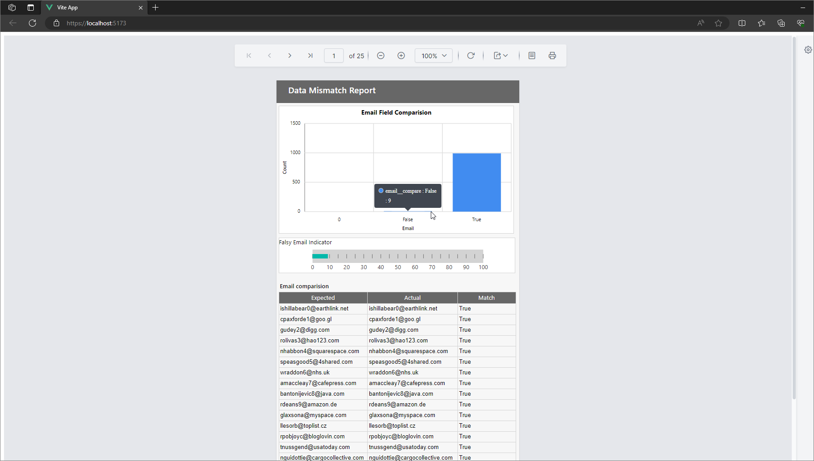

# Sample Analytic Report Utilizing VUE 3 and ASP.NET Core 7
This project showcases a sample analytic report created using the SSRS Reporting Tools.

## Prerequisite
Before setting up and running the project, ensure you have the following prerequisites installed:

* [Node JS - 18 and above](https://nodejs.org/en/download)
* [.Net Core 7.0 SDK](https://dotnet.microsoft.com/en-us/download/dotnet/7.0) 

## Tools used
The project leverages the following technologies:

* [Vue 3](https://vuejs.org/)
* [Reporting tools](https://www.nuget.org/packages/BoldReports.Net.Core)

## Project structure
The project is organized into the following components:

1. vueapp - contains code for client
2. webapi - contains code for server side api response

## RDL design
* webapi/report.rdl - this rdl is designed using Microsoft SSRS Reporting.

## Data source
* I have used [datasource](https://raw.githubusercontent.com/satsundev/compare-csv/main/inputs/diff/user_info_diff.csv) from [compare-csv](https://github.com/satsundev/compare-csv/) project used to compare two CSV files and diff them.

## How to run this project

* navigate to vueapp folder and open terminal and run the command `npm install`
* once npm packages installed successfully open the `AdminReport.sln` file in visual studio.
* Right click on the solution and click `restore nuget`.
* Once restoration is done, run the solution.

## Outcome
Upon successfully setting up and running the project, the end result can be visualized as shown below:

